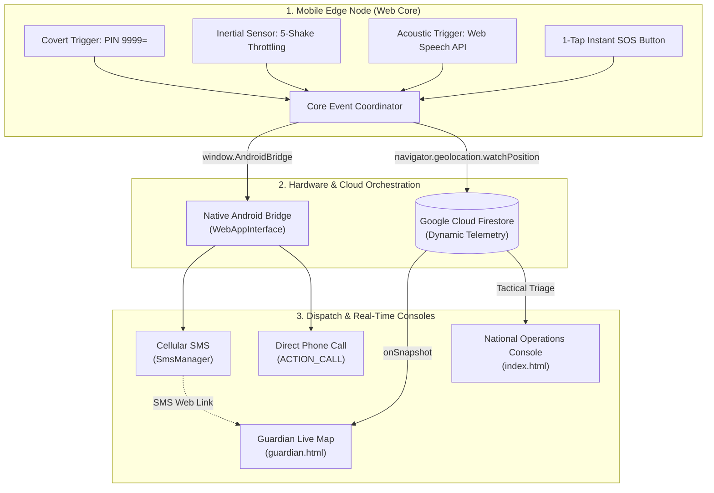

# Real-Time Women Safety Monitoring and Emergency Response Platform

A hybrid safety platform integrating responsive web runtime interfaces with native Android telephony hardware and real-time cloud data streams.

---

## 📱 Download Application
- 📥 **[Download SafeZone-v1.0.apk](SafeZone-v1.0.apk)**

---

## 🏗️ System Architecture



---

## 🚀 Key Features

* **Zero-Cost Background Telephony:** Uses native Android `SmsManager` and `Intent.ACTION_CALL` over cellular basebands, bypassing commercial SMS gateway costs.
* **Continuous Path Telemetry:** Live kinematic tracking using `navigator.geolocation.watchPosition` streamed directly to Google Cloud Firestore.
* **Multi-Modal Distress Triggers:**
  * **1-Tap SOS Dispatch:** Instant touch trigger for rapid emergency response.
  * **5-Shake Inertial Filter:** Motion-activated alert with temporal throttling ($\Delta t \ge 100$ ms, $\Delta a > 20\text{ m/s}^2$) to prevent false triggers and UI lockups.
  * **Acoustic Keyword Detection:** Background voice phrase recognition ("help", "emergency", "bachao") using the Web Speech Recognition API.
  * **Steganographic Stealth Mode:** Disguised functional calculator interface that secretly triggers the SOS sequence upon typing `9999=`.
* **Emergency Resolution:** One-touch "I Am Safe Here" routine that terminates GPS tracking, updates cloud state, and sends confirmation messages to guardians.
* **Multi-Dashboard Monitoring:** Dedicated mobile tracker for personal guardians (`guardian.html`) and centralized operations console with dynamic audio sirens (`index.html`)[cite: 2, 3].

---

## 📂 Repository Structure

```text
├── android/              # Native Android Studio project source code
│   └── app/src/main/     # MainActivity.java (bridge) & AndroidManifest.xml
├── app_icon.png          # High-resolution application icon asset
├── guardian.html         # Real-time single-victim tracking interface for guardians
├── index.html            # National operations console with tactical map & sirens
├── manifest.json         # PWA configuration and launcher asset references
├── mobile.html           # Core edge runtime: triggers, sensors, and telemetry daemon
├── Paper_draft.pdf       # IEEE-formatted research paper documentation
├── SafeZone-v1.0.apk     # Production compiled Android installation package
└── sw.js                 # Service worker for offline shell caching
```

---

## ⚠️ Installation Instructions (Android 13/14+)

1. Download the compiled package: **[SafeZone-v1.0.apk](SafeZone-v1.0.apk)**.
2. Open the `.apk` file on your device. When prompted by Google Play Protect, select **More details ➔ Install anyway**.
3. If background SMS dispatch or calling is blocked by Android's restricted permissions policy:
   * Open phone **Settings ➔ Apps ➔ SafeZone**.
   * Tap the three dots (**⋮**) in the top right corner ➔ **Allow restricted settings**.
   * Verify identity using your device PIN, pattern, or fingerprint.
   * Open **Permissions** and enable **SMS**, **Phone**, and **Location**.
4. Launch **SafeZone** and configure your emergency contacts in the vault drawer.

---

*Department of Computer Science and Engineering, Presidency University, Rajanukunte, India.*
